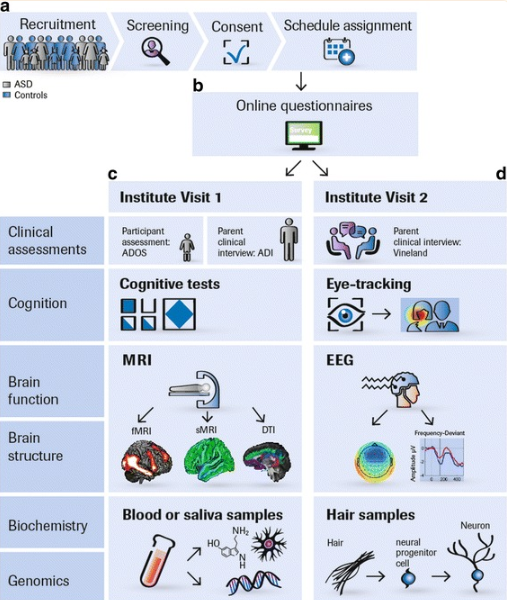

- [[Our-Pipeline-fMRI]]
- [[Our-Pipeline-MRI]]
- [[some papers]]
-
- {:height 196, :width 575}
- ## HCP
	- HCP Boston Adolescent Neuroimaging of Depression and Anxiety (BANDA)\
		- Link: [BANDA (mit.edu)](https://banda.mit.edu/index.html)  and [BANDA: Connectomes Related to Anxiety & Depression - Connectome - Publications (humanconnectome.org)](https://www.humanconnectome.org/study/connectomes-related-anxiety-depression)
- ## ABCD(Adolescent Brain Cognitive Development)
	- Downloading the raw imaging data from ABCD can take days to weeks, depending on computational resources. Converting the imaging data from DICOM to NIfTI format can also take weeks. For a team of 3–4 investigators working to generate connectivity matrices, processing and QC can take upwards of 8–9 months.
	- Reference:
		- [The Adolescent Brain Cognitive Development (ABCD) study: Imaging acquisition across 21 sites - ScienceDirect](https://www.sciencedirect.com/science/article/pii/S1878929317301214)
		  logseq.order-list-type:: number
		- logseq.order-list-type:: number
-
- ## ENIGMA
- ## UK Biobank
	- Distription: UK Biobank is a prospective epidemiological resource gathering extensive questionnaires, physical and cognitive measures, and biological samples (including genotyping) in a cohort of 500,000 participants
	- data modalities: r-fMRI, t-fMRI,  d-MRI, s-MRI,
	- Reference:
		- [Multimodal population brain imaging in the UK Biobank prospective epidemiological study | Nature Neuroscience](https://www.nature.com/articles/nn.4393)
		  logseq.order-list-type:: number
		- [: Resource 1977 (ox.ac.uk)](https://biobank.ndph.ox.ac.uk/showcase/refer.cgi?id=1977) brain imaging discription
		  logseq.order-list-type:: number
-
-
- ## SFARI(Simon Foundation Autism Research Initiative)
	- Link: https://www.sfari.org/
	- Simons Variation in Individuals Project (Simons VIP)
		- data modalities: fMRI, MRI, MEG, phenotypic, demographic, genomics data(SFARI is pleased to announce the release of genetic data for 119 Autism BrainNet brain tissue samples, including whole genome and whole exome data.)
		- sample size: more than 200
		- access: All SSC and VIP data are available by request after logging into S[FARI Base](https://sfari.org/resources/sfari-base).
		-
		-
- # LEAP
	- 
	  id:: 66ec2d6f-03a8-4829-b623-44d541dc58d5
	-
	-
-
- 等待整理，参考文献[Functional connectome through the human life span - PubMed (nih.gov)](https://pubmed.ncbi.nlm.nih.gov/37745373/)：
- 
-
- 