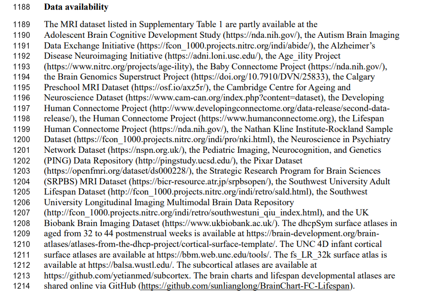

- [[Our-Pipeline-fMRI]]
- [[Our-Pipeline-MRI]]
- [[some papers]]
-
- {:height 196, :width 575}
-
- ## ABCD(Adolescent Brain Cognitive Development)
	- Downloading the raw imaging data from ABCD can take days to weeks, depending on computational resources. Converting the imaging data from DICOM to NIfTI format can also take weeks. For a team of 3–4 investigators working to generate connectivity matrices, processing and QC can take upwards of 8–9 months.
	- Reference:
		- [The Adolescent Brain Cognitive Development (ABCD) study: Imaging acquisition across 21 sites - ScienceDirect](https://www.sciencedirect.com/science/article/pii/S1878929317301214)
		  logseq.order-list-type:: number
		- logseq.order-list-type:: number
-
- ## ENIGMA
- ## UK Biobank
- Reference:
-
- ## SFARI(Simon Foundation Autism Research Initiative)
	- Simons Variation in Individuals Project (Simons VIP)
		- data modalities: fMRI, MRI, MEG, phenotypic, demographic, genomics data
		- sample size: more than 200
		- access: All SSC and VIP data are available by request after logging into S[FARI Base](https://sfari.org/resources/sfari-base).
		-
		-
-
-
- [Simons Foundation Autism Research Initiative | SFARI]()
-
- 等待整理，参考文献[Functional connectome through the human life span - PubMed (nih.gov)](https://pubmed.ncbi.nlm.nih.gov/37745373/)：
- 
-
- 