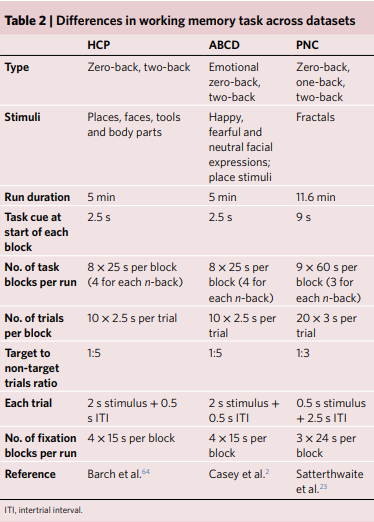
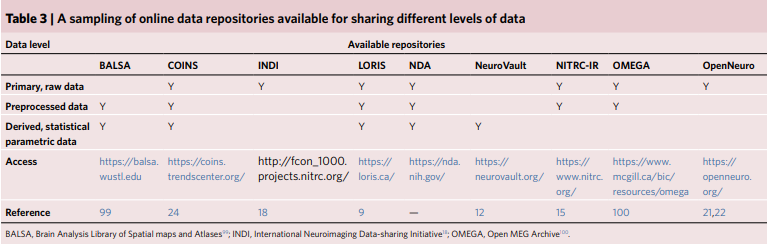

- 1. [【2022】A protocol for working with open-source neuroimaging datasets - ScienceDirect](https://www.sciencedirect.com/science/article/pii/S2666166721007838?fr=RR-2&ref=pdf_download&rr=8c143d11fecf714f#fig1)
- {:height 613, :width 514}
- The following reference ([Soares et al., 2016](https://www.sciencedirect.com/science/article/pii/S2666166721007838?fr=RR-2&ref=pdf_download&rr=8c143d11fecf714f#bib43)) is a good resource to get acquainted with some common tools used in fMRI processing and analysis and also serves as a good introduction to become acquainted with fMRI basics—from background on study design to tips on reporting/interpreting results.
-
-
- 2. [【2021】A hitchhiker’s guide to working with large, open-source neuroimaging datasets | Nature Human Behaviour](https://www.nature.com/articles/s41562-020-01005-4)
- 
- 
  id:: 66eb8cfe-fbf7-42c4-80be-6f87fda4ae45
-
-